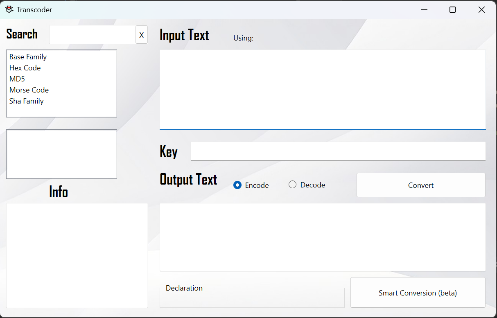
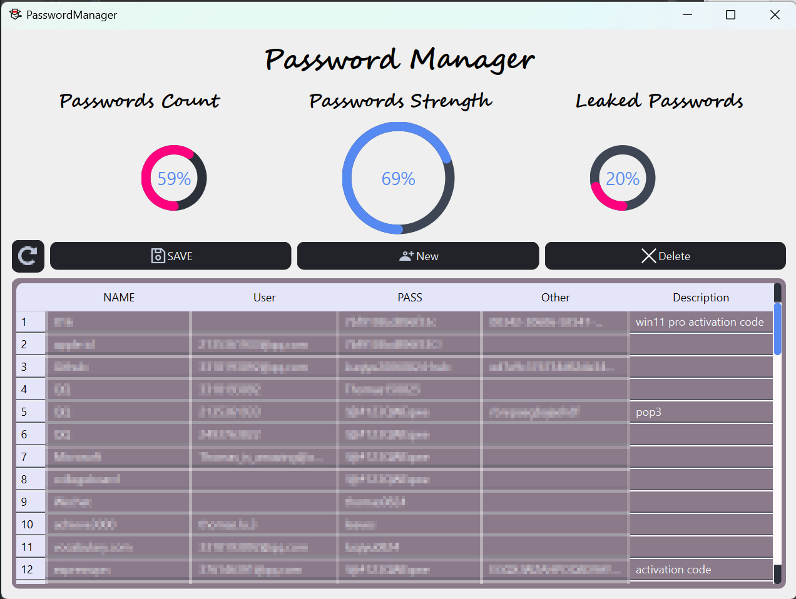

# SmartToolBox

# version 0.1.0

This is a smart toolbox that provides you a quick way to start up your programs and applications with a GUI launcher

## This Toolbox already include these programs:

## Password Manger

A password manager that stores your password into a local Mysql database

## Decoder-Encoder

A simple decoder and encoder that transform a string

currently supported coding methods:

### encode:

  md5

  sha family (sha1,sha224,sha256,sha384,sha512)

  base family (base 64, base 32, base 16)

  morse code

  hex code

### decode:

  hex code

  morse code

  base family

## Math Toolbox
A math toolbox that can visualize some important concepts

